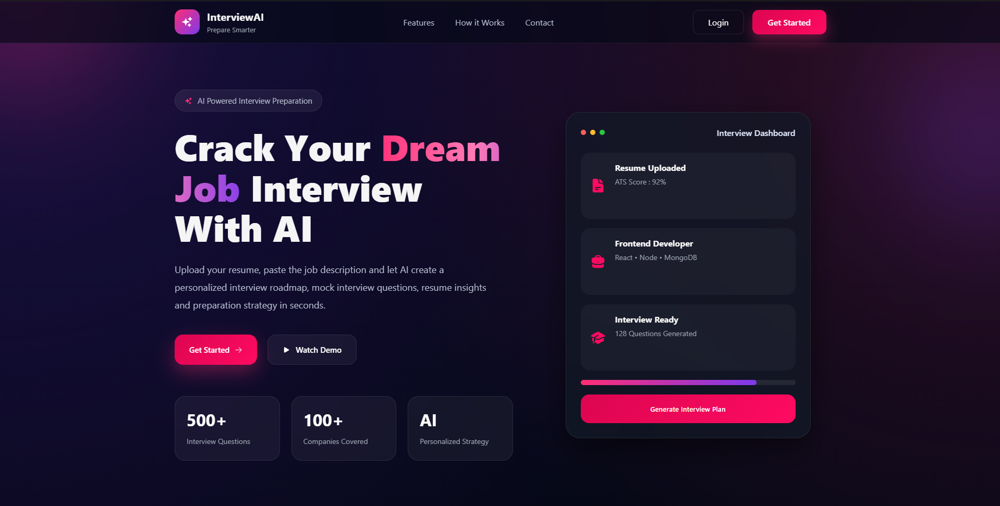
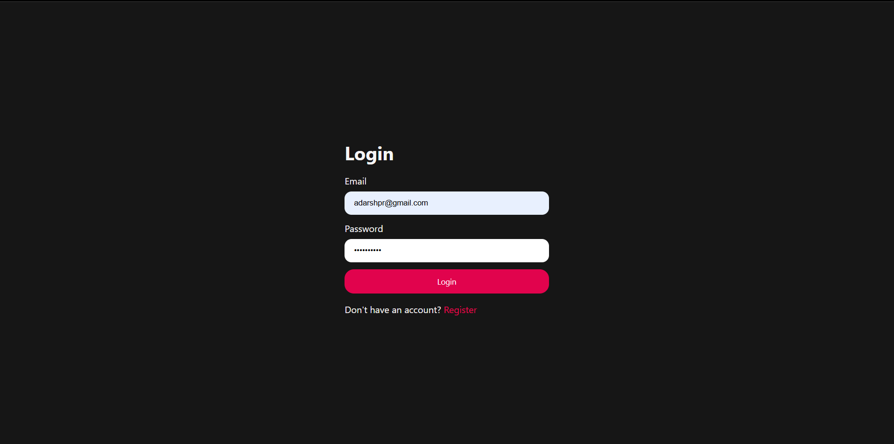
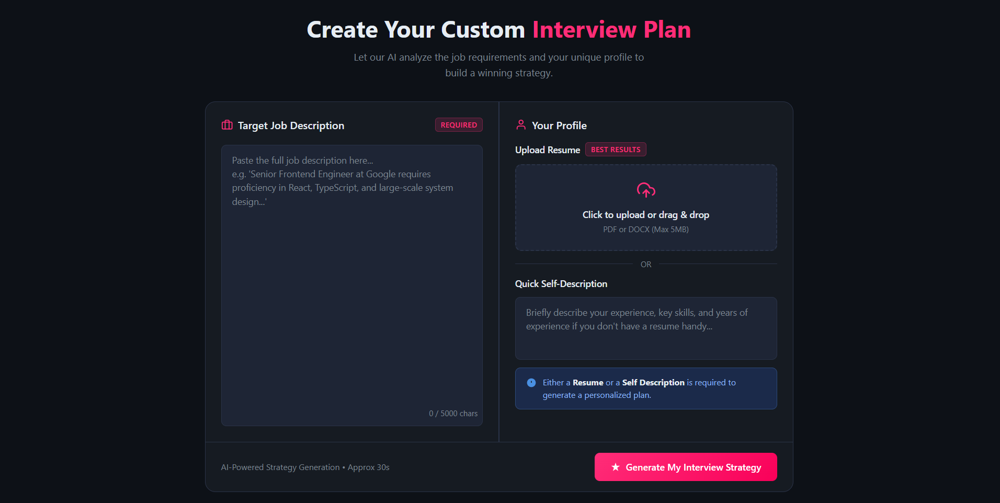
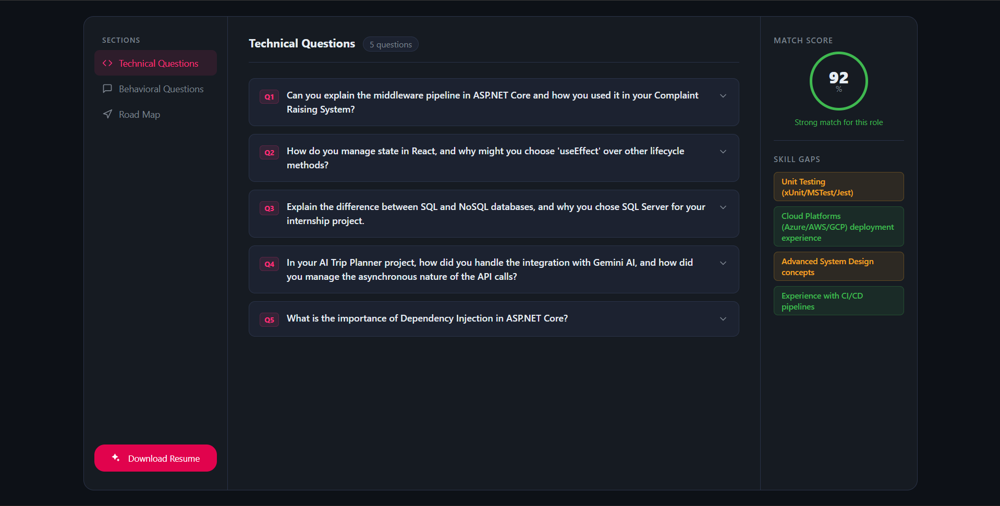
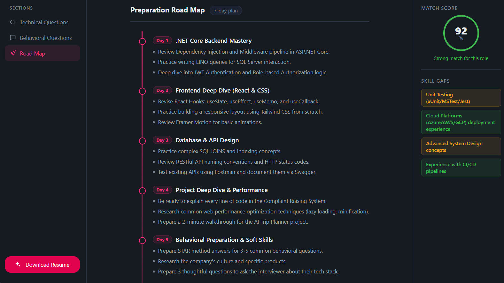

# 🚀 InterviewAI

An AI-powered Interview Preparation Platform built with the **MERN Stack** and **Generative AI**.

InterviewAI helps candidates prepare for interviews by analyzing their resume and the target job description to generate personalized interview questions, preparation roadmaps, and skill gap analysis.

---

## 📸 Screenshots

### Landing Page



### Login



### Interview Strategy Generator



### Technical Questions



### Preparation Roadmap



---

# ✨ Features

- Secure JWT Authentication
- Resume Upload
- Job Description Analysis
- AI-Powered Interview Questions
- Technical Interview Questions
- Behavioral Interview Questions
- Personalized Preparation Roadmap
- Resume Match Score
- Skill Gap Analysis
- Responsive Modern UI

---

# 🛠 Tech Stack

## Frontend

- React.js
- React Router
- SCSS
- Axios

## Backend

- Node.js
- Express.js

## Database

- MongoDB

## Authentication

- JWT
- Bcrypt

## AI

- Generative AI API

---

# 📂 Project Structure

```
client/
│
├── src/
├── components/
├── pages/
├── context/
├── services/
└── assets/

server/
│
├── controllers/
├── routes/
├── middleware/
├── models/
├── utils/
└── config/
```

---

# ⚙️ Installation

## Clone Repository

```bash
git clone https://github.com/Harsh-102003/AI-Interview-Preparation-Platform.git
```

## Install Dependencies

### Backend

```bash
cd server
npm install
```

### Frontend

```bash
cd client
npm install
```

---

## Environment Variables

Create a `.env` file inside the server folder.

```env
PORT=5000

MONGO_URI=your_mongodb_connection

JWT_SECRET=your_secret_key

GEMINI_API_KEY=your_api_key
```

---

## Run Backend

```bash
npm run dev
```

---

## Run Frontend

```bash
npm run dev
```

---

# 🎯 Future Improvements

- Voice-based AI Mock Interviews
- ATS Resume Scoring
- AI Resume Optimization
- Company-wise Interview Questions
- Coding Assessments
- Progress Tracking Dashboard

---

# 🤝 Contributing

Contributions are welcome! Feel free to fork this repository and submit pull requests.

---

# 📧 Contact

If you have any questions or suggestions, feel free to connect with me on LinkedIn.

---

⭐ If you found this project helpful, consider giving it a star!